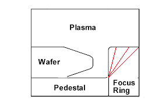

About
============================

### Tom Wilson

Data Scientist at Baker Hughes

BS Chemical Engineering University of Illinois at Urbana-Champaign 2010

MS Data Analytics University of Houston – Downtown 2019

7 years experience in semiconductor process engineering at Samsung in Austin, TX

3 years experience creating data analytic software at Baker Hughes in Houston, TX

### Focus Rings

During, the fabrication of computer chips, consumable Focus Rings are used to protect non-consumable components of Dry Etch Vacuum chambers.

Plasma density at the wafer's edge is sensitive to the geometry and material selection of these parts.



{cite}`van2004microchip`

```{bibliography} references.bib
```
